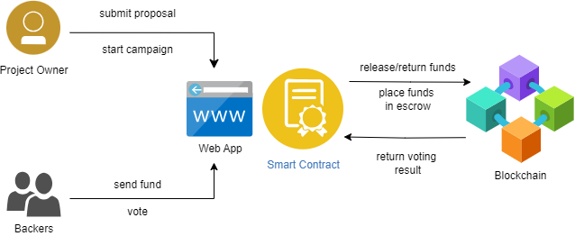

# Blockchain-based Crowdfunding Platform
Crowdfunding is a way of raising money to finance projects and businesses. It enables fundraisers to collect money from a large number of people via online platforms.

In this crowdfunding application, backers can make analysis and have a say in the progress of the project before an expenditure is made via their votes.
If backers are not convinced, the transfer of the money can be canceled as a result of the vote.

